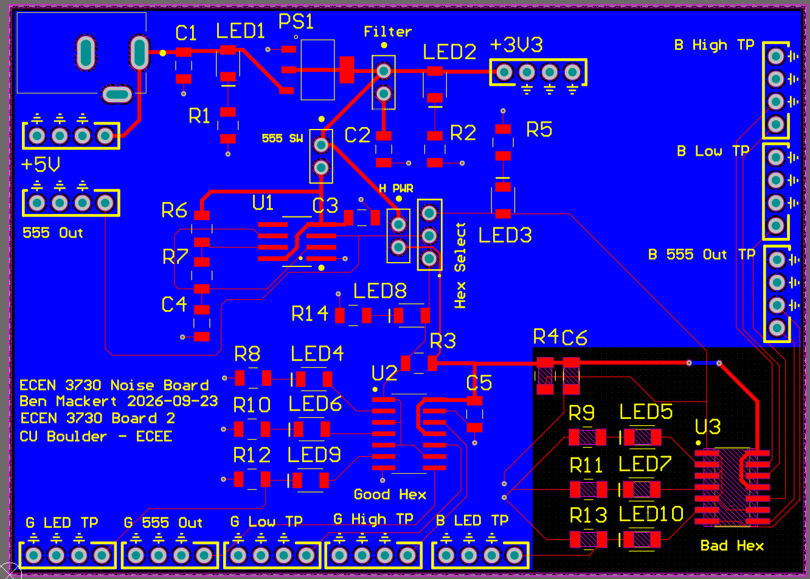
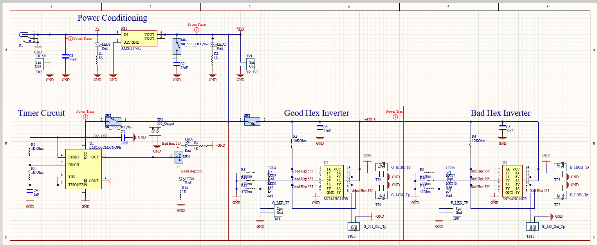
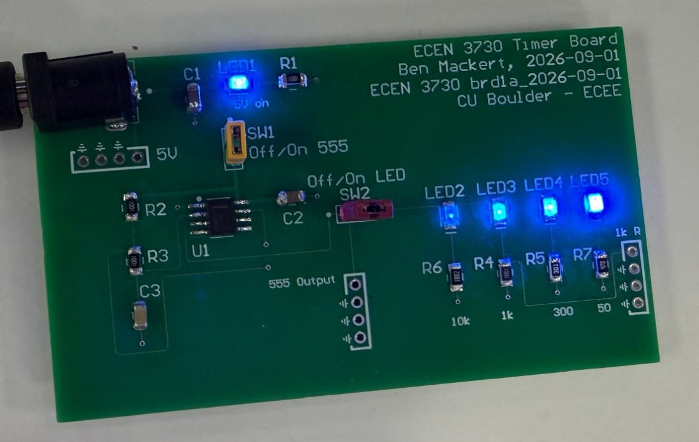

# Switching-Noise Demonstrator PCB: Good Layout vs. Bad Layout

**Ben Mackert** · CU Boulder ECEE · ECEN 3730 (PCB Design), Board 2 · Sept 2026

A two layer, 3.5 × 2.5 in board that runs the **same circuit twice**. One copy uses good layout practice and the other deliberately uses bad layout, so the switching noise difference can be measured directly on a scope.

*Top copper is red and the bottom ground pour is blue. The black rectangle (bottom right) is a cutout in the ground pour under the "Bad Hex" circuit.*

---

## The "heh, that's cute" feature: using the chip's spare gates as voltmeters for its own supply

The question this board answers is **how much the chip's internal VCC and ground move when its outputs switch**. You can't probe the silicon directly, and probing the board's 3.3 V rail gives the wrong answer: the noise is generated *in the inductance between the board and the die*, so the board rail looks clean while the die is bouncing.

The trick is to sacrifice two of the six gates on each SN74AHC14:

| Gate | Input tied to | Output is | What it reports |
|---|---|---|---|
| 6 | GND | permanently HIGH ("quiet HIGH") | Its output transistor connects the pin to the **on-die VCC**, so the pin shows VCC droop |
| 5 | VCC | permanently LOW ("quiet LOW") | Its output transistor connects the pin to the **on-die ground**, so the pin shows ground bounce |

A gate that never switches carries no current of its own, so its output pin is a near-ideal probe of the die's internal rail, relative to the board ground where the scope probe's ground spring sits. Two spare inverters plus two test points give a view inside the package for $0.

The other three gates are the aggressors. They switch three red LEDs through 47 Ω resistors (about 20 mA each, roughly 60 mA per edge in a few ns). The fourth gate is left unloaded and serves as a clean scope trigger and as the open-circuit reference for measuring the output's Thevenin resistance.

## The controlled experiment

The two hex inverter circuits use identical parts, identical placement and identical test points. **Only the layout differs:**

| | Good Hex (U2) | Bad Hex (U3) |
|---|---|---|
| Return path | Continuous ground plane; GND pin goes to the plane through a via about 1.3 mm away | Plane cut away; GND returned through a **35 mm, 6 mil trace** |
| Decoupling cap | About **4 mm** from VCC pin | About **28 mm** of trace from VCC pin |
| Rough L·dI/dt estimate | ~3 nH × 20 mA/ns ≈ **60 mV** | ~30 nH × 20 mA/ns ≈ **600 mV** |

A 3 pin jumper ("Hex Select") routes the 555 clock to one side at a time, and the scope triggers on that side's spare output. Quiet HIGH and quiet LOW from the good and bad sides can then be overlaid on one plot at the same scales (good traces always green, bad always yellow).

## Other small touches I'm happy with

- **Jumpers as isolation switches for staged bring-up.** Separate jumpers for the regulator filter cap, the 555 supply, the inverter supply and the clock routing mean each block can be powered and verified by itself.
- **A jumper that deliberately breaks the regulator.** The AMS1117's output capacitor sits on a jumper, so pulling it lets you watch the LDO's control loop go unstable and oscillate. Putting it back shows why that "filter" cap is not optional.
- **Unused inputs never float.** The clocked inputs on the unselected side are held HIGH by 10 kΩ pull-ups, so the board doesn't flicker when someone waves a hand over it.
- **Current sense on the low side.** Each 47 Ω LED resistor sits between the LED and ground, so the LED current is a ground-referenced voltage readable with a standard 10x probe; no differential probe needed.
- **Eleven 4-hole 10x probe test points**, each with a ground hole next to the tip for the short spring ground (no 6 inch ground-lead antenna). All are labeled by function ("G High TP", "B Low TP") instead of TP1…TP11.
- 0 DRC violations; passed the JLCPCB DFM check on the first submission.

## What I'd change in rev 2 (caught in self-review)

The selected-side indicator LED (LED + 1 kΩ to ground) sits on the same net as the 10 kΩ pull-up. On the *unselected* side these form a divider that parks the input near 1.8 V instead of 3.3 V, which is inside the 74AHC14's hysteresis band, so the input isn't guaranteed to read HIGH. The fix is to drive the indicator from an inverter *output* instead of the input net.

---

### Previous board (Board 1): 555 LED driver, worked first power-up with no rework

The 555 output measured 502 Hz at 66% duty cycle, against a predicted 481 Hz and 66.7%. Comparing the loaded and unloaded high levels with the isolation jumper gave a Thevenin output resistance of about 32 Ω for the LMC555. That lesson carried into Board 2: the driver's output resistance is comparable to a 47 Ω LED resistor, so it has to be part of the current calculation.
